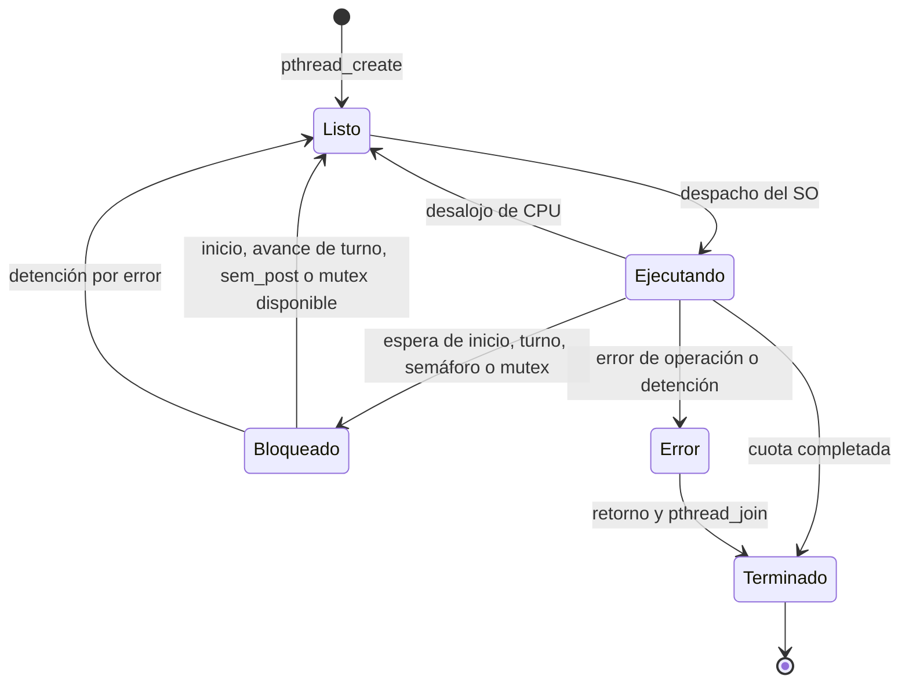
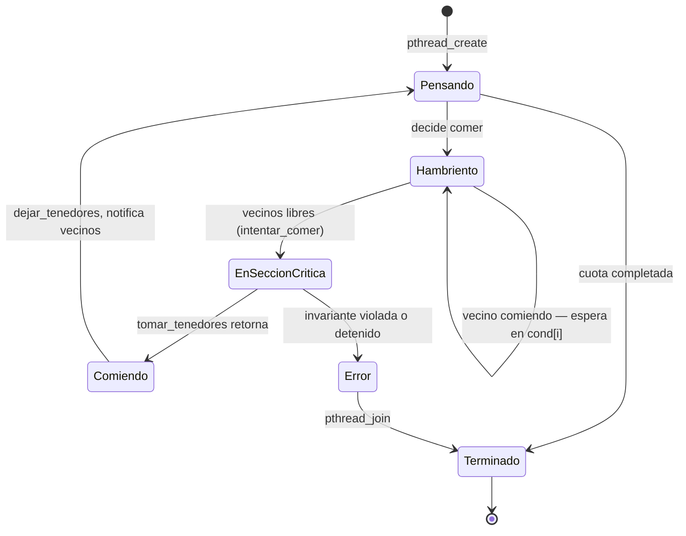

# Informe de la Entrega 2 — Módulo de Simulación Concurrente

> **Problemas clásicos de IPC implementados:**
> 1. **Productor–Consumidor con buffer acotado** (semáforos POSIX + mutex + monitor de turnos)
> 2. **Filósofos Comensales** (cinco mutexes de tenedores y adquisición asimétrica)
> 3. **Lectores-Escritores** (turnstile justo y acceso concurrente de lectores)
> 4. **Barbero Dormilón** (semáforos de clientes/barbero y sillas limitadas)
>
> Ambos demuestran control absoluto de *race conditions* y regiones críticas con pthreads.

## Diseño e integración

El programa resuelve productor–consumidor con buffer circular acotado. Conserva el núcleo POSIX de las fases 1 y 2: `sem_vacios` comienza en `BUFFER_SIZE`, `sem_llenos` en cero y `mutex_buffer` protege datos, índices y contador. La configuración normal tiene dos productores, dos consumidores, seis operaciones por hilo y cinco posiciones.

`src/monitor.c` añade dos colas de turnos FIFO, una por tipo de hilo, un inicio coordinado, detención por error, logger y mediciones individuales. Su interfaz está en `include/monitor.h`. Todos los hilos creados esperan el inicio; el principal lo habilita únicamente después de crear el conjunto completo. Ante un fallo de creación se despiertan y recogen los hilos ya creados, antes de destruir los recursos y sus contextos.

Cada operación sigue esta secuencia:

1. Registrar `ESPERANDO RECURSO` y obtener un ticket en la cola de su tipo.
2. Esperar su turno mediante una variable de condición, que libera el mutex del monitor durante la espera. Las guardas se revisan en un bucle para admitir despertares espurios.
3. Soltar el mutex del monitor, esperar el semáforo correspondiente y comprobar la detención.
4. Tomar `mutex_buffer`, registrar `EN SECCION CRITICA`, modificar el buffer y comprobar `0 <= contador <= BUFFER_SIZE`.
5. Registrar `LIBERANDO`, soltar `mutex_buffer` y publicar el semáforo complementario.
6. Registrar el dato fuera del mutex del buffer, incrementar el progreso y avanzar el turno de su tipo. La pausa configurable ocurre después de liberar los recursos.

El turno es una autorización lógica, no un mutex retenido durante `sem_wait`. Como productores y consumidores tienen colas independientes, un productor que espera espacio no impide que avance un consumidor, y viceversa.

Los identificadores de datos son `(id_productor - 1) * TOTAL_ITEMS + iteracion + 1`: los intervalos de cada productor son disjuntos incluso al superar 100 operaciones. La compilación rechaza buffer vacío, cantidades no positivas, cantidades distintas de productores y consumidores, pausas negativas e identificadores que excedan el rango previsto de `int`. Esta implementación asigna la misma cuota positiva a cada hilo y requiere cantidades equilibradas.

## Estados y trazabilidad



Listo, Ejecutando y Bloqueado describen el modelo de planificación. El programa registra sus propios eventos; no observa directamente cada despacho o desalojo del kernel. `ESPERANDO RECURSO` indica que empieza a adquirir recursos, aunque estos podrían estar inmediatamente disponibles.

Ejemplo de una operación:

```text
[HILO Productor 1] -> ESTADO: ESPERANDO RECURSO
[HILO Productor 1] -> ESTADO: EN SECCION CRITICA
[HILO Productor 1] -> ESTADO: LIBERANDO
[Productor 1] Inserto: 1 en posicion [0]
```

El tipo y el ID identifican cada hilo sin ambigüedad. El logger usa un mutex propio para publicar líneas completas; la salida tiene buffering por línea, incluso al redirigirla. Solo se imprimen dos transiciones breves dentro del mutex del buffer, sin pausas artificiales. Los datos y resúmenes se imprimen fuera. Un consumidor puede publicar el registro de un dato antes del registro de inserción de ese dato, porque el productor publica el semáforo antes de registrar el dato. Por eso la prueba compara conjuntos y valida el orden de estados de cada hilo, sin interpretar el orden global de líneas como el orden de modificación del buffer.

Al finalizar, cada hilo imprime operaciones completadas, espera total y espera máxima en milisegundos. La espera se mide con `CLOCK_MONOTONIC` desde antes de registrar la solicitud hasta la adquisición del mutex del buffer; incluye inicio, turno, semáforo, mutex y el costo de esa primera traza. No incluye las pausas posteriores a la operación. Los valores son observaciones, no límites garantizados.

## Exclusión mutua y condiciones de Coffman

La exclusión mutua se mantiene: un solo hilo modifica el buffer a la vez. La falta de apropiación también se mantiene para el mutex. La estrategia rompe la espera circular mediante un orden de recursos y la ausencia de retención de mutexes al esperar semáforos:

- El mutex del monitor solo protege tickets y banderas; se suelta antes de adquirir semáforos o `mutex_buffer`.
- Un hilo espera `sem_vacios` o `sem_llenos` antes de tomar `mutex_buffer`. Nunca espera un semáforo reteniendo ese mutex.
- La única adquisición anidada de mutexes es `mutex_buffer -> logger`. El logger no solicita el buffer ni el monitor, por lo que no existe la arista inversa.
- El avance de tickets toma el mutex del monitor después de liberar buffer y logger. La variable de condición libera ese mutex al bloquearse.

Por tanto, el grafo de dependencias entre mutexes no contiene ciclos. Un titular de `mutex_buffer` puede terminar la modificación sin necesitar un recurso retenido por quien espera ese mutex. La salida debe seguir siendo atendida para que el logger progrese; no se contempla un destino de salida permanentemente bloqueado.

Además, las colas por tipo no introducen un ciclo lógico. Si un productor con turno está bloqueado por buffer lleno, existe un dato consumible o una operación consumidora en curso que publicará un espacio. Si un consumidor con turno está bloqueado por buffer vacío, existe capacidad para un productor o una operación productora en curso que publicará un dato. Con `BUFFER_SIZE > 0`, ambas condiciones no pueden impedir simultáneamente todo progreso. Una reserva de permiso está seguida de una sección finita y de la publicación complementaria.

Durante la ejecución normal, cada inserción corresponde a una reserva de espacio y cada extracción a una reserva de dato. Los permisos reservados o pendientes de publicación explican por qué no se debe exigir `sem_vacios + sem_llenos == BUFFER_SIZE` en todo instante. El invariante relevante del buffer es `0 <= contador <= BUFFER_SIZE`. Al terminar las cuotas equilibradas se espera `contador == 0`.

Estos argumentos presuponen planificación que permita avanzar a los hilos habilitados, operaciones de sincronización correctas y secciones finitas. No requieren `pthread_mutex_trylock`: la ruptura de espera circular ya está incorporada en el orden de adquisición.

## Inanición y alcance de la equidad

El monitor asigna tickets crecientes bajo mutex. Para cada tipo solo opera el ticket `atendiendo`; este avanza una vez por operación completada. Un hilo con ticket asignado no puede ser adelantado por solicitudes posteriores de su mismo tipo. Hay a lo sumo `N_tipo - 1` operaciones del mismo tipo delante de una solicitud, porque cada hilo tiene una única solicitud pendiente.

Con cuotas equilibradas, progreso del tipo complementario, planificación justa y adquisición eventual de los mutexes, cada ticket pendiente termina siendo atendido. La política evita que un hilo rápido adelante repetidamente a otro que ya está encolado. No promete un tiempo máximo de espera ni garantiza que el SO planifique un hilo que aún no logró solicitar ticket. No se atribuye equidad universal a los semáforos POSIX.

Las pruebas comprueban que **cada hilo**, incluidos los de los escenarios de velocidades diferentes, termina su cuota. Esto aporta evidencia empírica de ausencia de inanición en las ejecuciones observadas; una batería finita no demuestra una garantía universal del planificador.

## Manejo de errores

`sem_wait` reintenta `EINTR`. Otros errores detienen el monitor y se propagan como fallo del hilo y del proceso. La primera detención despierta las colas y publica permisos de emergencia para desbloquear las esperas de semáforo. Los hilos comprueban la detención antes de tocar el buffer; dichos permisos no representan datos y solo se usan para terminar la ejecución fallida. El principal recoge todos los hilos creados antes de destruir recursos. No se declara éxito ni se exige buffer vacío en una ejecución abortada.

Un fallo de `pthread_join` o al liberar el mutex del buffer termina el proceso con error: no es seguro continuar destruyendo recursos si no se puede confirmar la recolección o liberación. La recuperación cooperativa comprobada cubre creación parcial y errores de espera; no intenta recuperar corrupción de objetos de sincronización.

## Compilación y reproducción

Se requieren GCC, make, Bash, Python 3 y `timeout` de GNU coreutils. Los flags son `-Wall -Wextra -std=c11 -pedantic -D_POSIX_C_SOURCE=200809L`, con `-pthread` al compilar y enlazar todos los binarios concurrentes. Las herramientas ya estaban disponibles en Ubuntu; no fue necesario instalarlas.

```bash
make clean
make
make test
```

`make test` incluye redirección de la shell, configuración concurrente normal, estrés, velocidades distintas y fallos inyectados. Las reglas independientes son `test-shell`, `test-concurrent`, `test-stress` y `test-fallos`. `make concurrent` muestra la ejecución normal.

```bash
# Cambiar la cantidad de ejecuciones del escenario de alta contención:
RUNS=40 make test-stress
# Ejecutar directamente un binario con un límite distinto:
RUNS=5 LIMIT=20s bash tests/test_stress_concurrente.sh ./fase2_concurrente_stress
```

Los escenarios asimétricos ejecutan tres repeticiones cada uno. Todos los escenarios tienen timeout externo; el límite predeterminado es 15 segundos por proceso. La configuración esperada se obtiene de `[CONFIG]` del propio binario y se comprueba con `tests/validar_concurrente.py`, sin cantidades fijas desfasadas en el script.

La validación comprueba finalización exitosa, buffer final vacío, cuotas individuales, secuencia de todas las transiciones por hilo, un resumen por hilo, posiciones válidas, métricas no negativas, identificadores únicos y coincidencia exacta entre datos producidos y consumidos. El binario también comprueba el rango del contador después de cada modificación.

La inyección de fallos está en `tests/fallos_concurrente.c` y solo se enlaza en `fase3_fallos` usando `--wrap` de GNU ld. Interrumpe la primera espera de cada hilo con `EINTR`, provoca `EAGAIN` en la cuarta creación y provoca `EIO` en la primera espera. Las dos ejecuciones fallidas deben devolver código 1 antes del timeout; se verifican los resúmenes de todos los hilos creados. La creación parcial debe terminar sin insertar ni consumir datos.

## Resultados observados en Ubuntu

Validación realizada el 6 de octubre de 2026 (America/Lima), con GCC 15.2.0 y Linux 7.0.0-31-generic.

| Escenario | Productores / consumidores | Buffer | Operaciones por hilo | Pausas productor / consumidor | Repeticiones | Resultado |
| --- | --- | --- | --- | --- | --- | --- |
| Normal | 2 / 2 | 5 | 6 | 100 / 150 ms | 1 | 12 datos únicos; todos los hilos completaron |
| Alta contención | 10 / 10 | 1 | 1000 | 0 / 0 ms | 20 | 200 000 datos en total; sin pérdidas, duplicados ni timeout |
| Productor lento | 10 / 10 | 5 | 100 | 1 / 0 ms | 3 | 3000 datos en total; todas las cuotas completas |
| Consumidor lento | 10 / 10 | 5 | 100 | 0 / 1 ms | 3 | 3000 datos en total; todas las cuotas completas |
| Interrupción de espera | 2 / 2 | 5 | 6 | 0 / 0 ms | 1 | Reintento de EINTR; 12 datos correctos |
| Creación parcial | 2 / 2 | 5 | 6 | 0 / 0 ms | 1 | Código 1; tres hilos recogidos; cero operaciones |
| Error de espera | 2 / 2 | 5 | 6 | 0 / 0 ms | 1 | Código 1; cuatro hilos recogidos; sin bloqueo |

La prueba de redirección de la shell también pasó. Se conservan los nombres `fase2_concurrente` y `fase2_concurrente_stress` para compatibilidad, aunque ahora integran el monitor de fase 3. Los binarios generados están ignorados en Git y `make clean` los elimina.

La mayor espera individual registrada en la validación final fue 3.869 ms. La salida resumida de la suite y sus valores por ejecución se conservan en [evidencia_pruebas_fase3.txt](evidencia_pruebas_fase3.txt). Este máximo describe esa ejecución de la suite y puede variar al repetirla.

## Presentación de las pruebas en terminal

La salida de `make test` y `make test-stress` separa los escenarios con títulos y presenta una tabla por ejecución: estado, datos únicos verificados, hilos que completaron su cuota y espera máxima observada en milisegundos. Cada escenario termina con el total de datos y su mayor espera. Los comandos largos de compilación se ocultan por defecto y se reemplazan por `[COMPILAR] nombre`; los diagnósticos del compilador y los registros de una prueba fallida permanecen visibles.

Para mostrar también los comandos completos, usar `make V=1 test-stress`. El indicador `OK` usa verde solamente en una terminal compatible; las salidas redirigidas quedan sin códigos de color. `NO_COLOR=1 make test-stress` desactiva el color. La presentación conserva las mismas validaciones de datos, cuotas y trazas.

La ejecución directa de `./fase2_concurrente` en una terminal muestra la configuración, transiciones con tiempo relativo al inicio del monitor y una tabla final de cuotas y esperas por hilo. Los resúmenes se imprimen después de recoger todos los hilos. Los colores distinguen espera, sección crítica, terminación y error, y pueden desactivarse con `NO_COLOR=1 ./fase2_concurrente`. Al redirigir la salida se conserva el formato original de trazas y resúmenes para la validación automática; ese modo sigue publicando el resumen de cada hilo al terminar su rutina. Los tiempos de la columna de transiciones se toman al publicar cada evento y no representan despachos del kernel.

---

## Problema 2 — Filósofos Comensales (`src/filosofos.c`)

La implementación usa exactamente cinco mutexes, uno por tenedor. Cada filósofo
adquiere sus dos tenedores antes de comer; cuatro toman primero el izquierdo y
el filósofo 4 toma primero el derecho, rompiendo la espera circular descrita en
el video. Un mutex de turno protege la adquisición del par y evita que un
filósofo sea adelantado indefinidamente. Los tenedores se liberan siempre al
terminar la sección crítica.

## Problemas 3 y 4 — Lectores-Escritores y Barbero Dormilón

`src/lectores_escritores.c` implementa lectores concurrentes y escritores
exclusivos. El contador de lectores está protegido por `count_mutex`; el primer
lector bloquea el recurso y el último lo libera. `turnstile` impide que nuevos
lectores adelanten a un escritor que ya está esperando, evitando inanición.

`src/peluquero.c` implementa un barbero que duerme en `sem_clientes`, una cola
limitada por `N_SILLAS` y clientes que se retiran cuando no hay espacio. El
mutex protege la decisión de sentarse y los semáforos coordinan el despertar y
la atención.

### Enunciado clásico (Dijkstra, 1965)

Cinco filósofos comparten una mesa circular. Entre cada par de filósofos hay un tenedor, cinco en total. Para comer, un filósofo necesita los dos tenedores adyacentes a su asiento. Si todos tomaran primero el tenedor izquierdo y esperaran el derecho, se produciría un **deadlock** circular donde ninguno avanza.

### Diseño del monitor

La solución abandona el modelo de "mutex por tenedor" (que genera deadlock) y centraliza todo el estado en un único monitor POSIX:

```c
typedef struct {
    pthread_mutex_t   mutex;              // Exclusión mutua del estado global
    pthread_cond_t    cond[N];            // Una variable de condición por filósofo
    estado_filosofo_t estado[N];          // PENSANDO | HAMBRIENTO | COMIENDO
    bool              detenido;
    pthread_mutex_t   logger;             // Logger separado, sin bloquear el monitor
} mesa_t;
```

**Secuencia de cada filósofo** (N rondas):

```
PENSANDO  →  HAMBRIENTO  →  [espera en cond[i]]  →  COMIENDO  →  PENSANDO
```

La transición `HAMBRIENTO → COMIENDO` solo ocurre si ningún vecino está comiendo, y se decide **dentro del mutex del monitor** mediante la función `intentar_comer()`:

```c
static void intentar_comer(mesa_t *m, int i) {
    if (m->estado[i]      == FILOSOFO_HAMBRIENTO &&
        m->estado[izq(i)] != FILOSOFO_COMIENDO   &&
        m->estado[der(i)] != FILOSOFO_COMIENDO)
    {
        m->estado[i] = FILOSOFO_COMIENDO;
        pthread_cond_signal(&m->cond[i]);  // Despierta al filósofo i
    }
}
```

Cuando un filósofo deja los tenedores, notifica a sus dos vecinos:

```c
static void dejar_tenedores(mesa_t *m, int i) {
    pthread_mutex_lock(&m->mutex);
    m->estado[i] = FILOSOFO_PENSANDO;
    intentar_comer(m, izq(i));   // ¿puede comer el vecino izquierdo?
    intentar_comer(m, der(i));   // ¿puede comer el vecino derecho?
    pthread_mutex_unlock(&m->mutex);
}
```

### Diagrama de estados de un filósofo



### Demostración de ausencia de deadlock

Se rompe la **condición de Coffman nº 4: espera circular**.

**Argumento formal:**

Para que exista deadlock circular se requiere una cadena:
`h₁ espera recurso de h₂, h₂ espera de h₃, …, hₖ espera de h₁`.

En esta implementación **solo existe un recurso compartido protegido**: `mesa_t.mutex`. Las condiciones de espera (`pthread_cond_wait`) **liberan automáticamente** ese mutex mientras el hilo duerme. Por tanto:

- Ningún hilo sostiene `mutex` mientras espera en `cond[i]`.
- El único orden de adquisición de candados es: `mutex → logger` (nunca al revés).
- No existe la cadena de dependencias cruzadas que requiere el deadlock.

**Corolario:** Un filósofo que espera en `cond[i]` libera el mutex, permitiendo que cualquier vecino que termine de comer adquiera el mutex, llame a `intentar_comer()` y lo despierte. El progreso es garantizable siempre que el planificador del SO eventualmente despache hilos habilitados.

### Verificación de la invariante en tiempo de ejecución

Después de obtener el permiso de comer (`tomar_tenedores` retorna), cada hilo **comprueba explícitamente** que ningún vecino esté en estado `COMIENDO`:

```c
bool vecino_come = (m->estado[izq(ctx->id)] == FILOSOFO_COMIENDO) ||
                   (m->estado[der(ctx->id)] == FILOSOFO_COMIENDO);
if (vecino_come) {
    fprintf(stderr, "[ERROR CRITICO] Filosofo %d y vecino comen al mismo tiempo!\n", ctx->id);
    ctx->error = 1;
    /* parada de emergencia: despierta a todos */
    ...
}
```

Si esta condición se dispara, la simulación reporta el error y termina con código 1. En ninguna ejecución de la suite se ha disparado.

### Separación de responsabilidades de sincronización

| Primitiva | Propósito | Scope |
|---|---|---|
| `mesa_t.mutex` | Exclusión mutua del estado de filósofos | Sección crítica del monitor |
| `mesa_t.cond[i]` | Espera eficiente de condición por filósofo | Dentro del mutex del monitor |
| `mesa_t.logger` | Serialización de salida de texto | Independiente del monitor |

El `logger` **nunca** se adquiere con `mutex` tomado, evitando nuevos ciclos de dependencia.

### Comandos para compilar y ejecutar

```bash
# Compilar y ejecutar los 5 filósofos con pausas visuales
make filosofos

# Ejecutar la suite de pruebas de filósofos (normal + estrés 10 filósofos × 500 rondas)
make test-filosofos

# Parámetros personalizados en tiempo de compilación
gcc -Iinclude -Wall -Wextra -std=c11 -D_POSIX_C_SOURCE=200809L \
    -DNUM_FILOSOFOS=7 -DRONDAS_FILOSOFO=10 -DPAUSA_COMER_MS=50 \
    -pthread src/main_filosofos.c src/filosofos.c -o mi_filosofos
```

### Resultados del escenario de estrés

| Escenario | Filósofos | Rondas c/u | Pausas | Repeticiones | Resultado |
|---|---|---|---|---|---|
| Normal | 5 | 4 | 80 / 60 ms | 1 | Todos terminan, invariante OK |
| Estrés | 10 | 500 | 0 / 0 ms | 10 | 5000 rondas por filósofo, sin deadlock ni race |

La prueba de estrés con 10 filósofos y 0 ms de pausa genera la máxima contención posible: cada filósofo intenta comer tan pronto como puede, sometiendo el monitor a miles de adquisiciones concurrentes del mutex. Ningún filósofo ha quedado bloqueado permanentemente en ninguna de las ejecuciones registradas.
